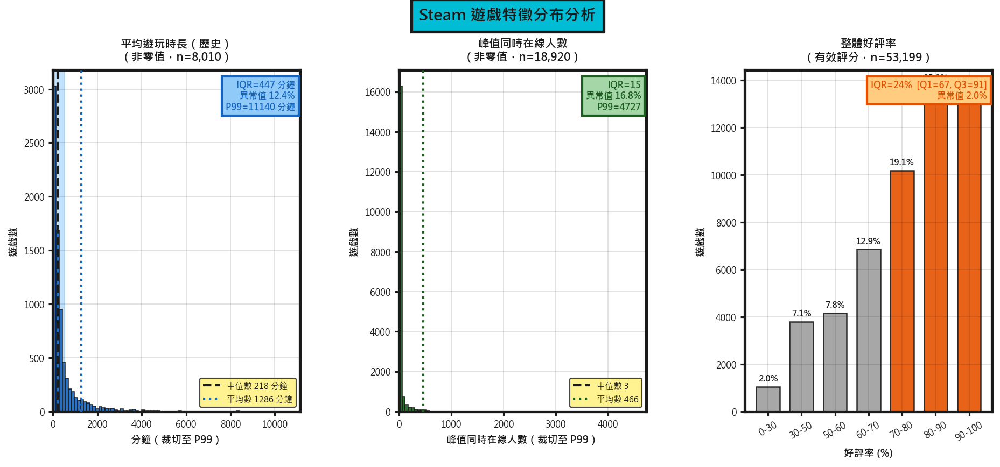
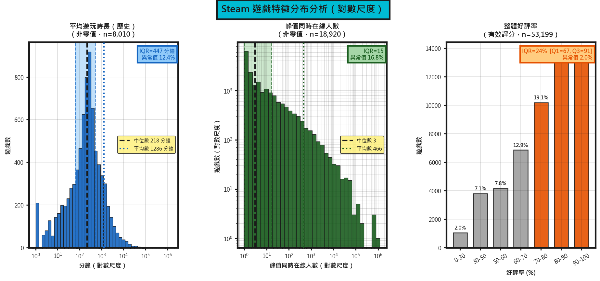
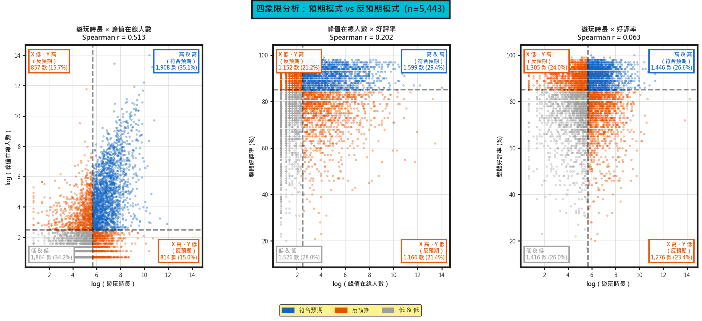

# 特徵分布與關聯分析

## 圖三：三維特徵原始分布（含 IQR）

`average_playtime_forever`、`peak_ccu` 與 `pct_pos_total` 三項特徵在原始尺度下均呈現高度不對稱的分布型態。為使分布形狀可視，前兩項特徵的直方圖已裁切至第 99 百分位數（P99），排除極端高值對 x 軸尺度的主導；裁切閾值標示於各圖右上角（Playtime P99 = 11,140 分鐘，CCU P99 = 4,727），所有統計指標仍基於完整樣本計算。

**平均遊玩時長（average_playtime_forever）** 在全體 89,618 筆資料中，有 91.1% 的遊戲紀錄值為零，顯示大多數遊戲幾乎無人留下遊玩記錄。排除零值後，有效樣本（n=8,010）的中位數為 218 分鐘，但均值高達 1,286 分鐘，偏態係數達 49.59，呈現極度右偏的長尾分布——即便裁切至 P99 後，仍可清楚觀察到絕大多數遊戲集中於低遊玩時長區間，尾部迅速衰減。四分位距（IQR）為 447 分鐘（Q1=64, Q3=511），12.4% 的資料點落於 Tukey 圍籬之外。

**峰值同時在線人數（peak_ccu）** 有 78.9% 的遊戲峰值 CCU 為零，非零樣本（n=18,920）中位數僅為 3，均值為 466，偏態係數高達 70.48，符合典型的冪次律（power-law）分布特徵。裁切至 P99（CCU = 4,727）後，分布型態仍高度集中於最左側，視覺上幾乎為一條垂直峰，說明壓倒性多數的遊戲 CCU 極低。IQR 僅有 15（Q1=1, Q3=16），前 1% 的遊戲卻佔據全體 CCU 總量的 84.1%，熱度極度集中於少數頭部作品，異常值比例達 16.8%。

**整體好評率（pct_pos_total）** 以 -1 作為「無評分」的 sentinel 值，佔全體資料的 40.6%（36,419 筆）。有效評分樣本（n=53,199）呈輕度左偏分布（偏態係數 -1.05），中位數為 81%，IQR 為 24 個百分點（Q1=67%, Q3=91%），72.0% 的遊戲好評率達 70% 以上，異常值比例僅 2.0%，顯示具有公開評分的遊戲整體評價偏正向，且分布形狀在原始尺度下即清晰可辨，無需裁切。

---

## 圖二：對數尺度下的分布結構

由於 `average_playtime_forever` 與 `peak_ccu` 在原始尺度下的極端右偏特性，圖三的直方圖中幾乎所有資料點均壓縮於 x 軸最左側，難以辨識分布結構。圖二對前兩項特徵施以 log(1+x) 轉換，將乘法量級間的差距壓縮至可視範圍，使長尾中每個量級的遊戲均能在圖中佔有對應位置，完整參與視覺分析。值得注意的是，對數轉換為單調函數，不改變資料點的排名順序，亦不影響後續以 Spearman 秩相關為基礎的關聯觀察結果——我們所觀察到的相對強弱關係在轉換前後保持一致。

在對數尺度下，`average_playtime_forever` 呈現以 2–5 小時區間（120–300 分鐘）為峰值的單峰分布；`peak_ccu` 則在雙對數坐標（log-log）下呈近似線性遞減，進一步確認其冪次律性質——絕大多數遊戲 CCU 落在個位數，隨數量級提升遊戲數急劇減少。`pct_pos_total` 分布本身無需對數轉換，其左偏集中態勢在原始尺度下已清晰可辨。

IQR 區間在圖二中以淡色背景標示，可見三項特徵的 50% 核心資料集中範圍：遊玩時長集中於 1–8.5 小時（log 尺度 Q1–Q3），CCU 集中於 1–16（個位至十餘人），好評率集中於 67–91%。

---

## 圖一：四象限關聯分析

為探討三項特徵之間的成對關聯，本分析聚焦於三項指標同時具有有效紀錄的遊戲（average_playtime_forever > 0、peak_ccu > 0、pct_pos_total ≥ 0），取得交集樣本 5,443 筆。此篩選條件具有實質意義：若一款遊戲的遊玩時長、同時在線人數與評分均為零或缺失，可合理推斷其市場表現極為有限，難以提供有意義的特徵關聯訊息；因此本分析將焦點置於「至少具備基礎市場能見度」的遊戲群體，探討在這些有機會被玩家接觸到的遊戲之中，三項特徵之間實際呈現何種關聯型態。各對特徵以其中位數為切點劃分四個象限，計算各象限遊戲佔比。

**Playtime × CCU（Spearman r = 0.513）** 呈中度正相關，兩者存在明顯的共移趨勢。符合預期的「高遊玩時長 & 高 CCU」象限佔 35.1%，「低 & 低」佔 34.2%，合計 69.3% 的遊戲落於預期對角線上。反預期象限（高遊玩低 CCU，或低遊玩高 CCU）各約佔 15%，顯示遊玩時長與熱度雖正相關，但仍存在相當比例的例外——如高遊玩時長卻冷門的小眾深度遊戲，或高曝光卻留存率低的淺玩遊戲。

**CCU × 好評率（Spearman r = 0.202）** 為弱正相關，「高 CCU & 高好評率」佔 29.4%，反預期的「高 CCU & 低好評率」達 21.4%，兩者差距相對縮小。此現象反映部分熱門遊戲雖擁有大量玩家，卻因設計爭議或更新失誤累積大量負評，熱度與口碑之間存在明顯的分離。

**Playtime × 好評率（Spearman r = 0.063）** 四象限比例接近均勻分布（各約 23–27%），兩者幾乎獨立。遊玩時長長不代表評分高，評分高也不保證玩家持續投入，說明這兩個維度在捕捉遊戲價值時具有互補而非冗餘的資訊。
